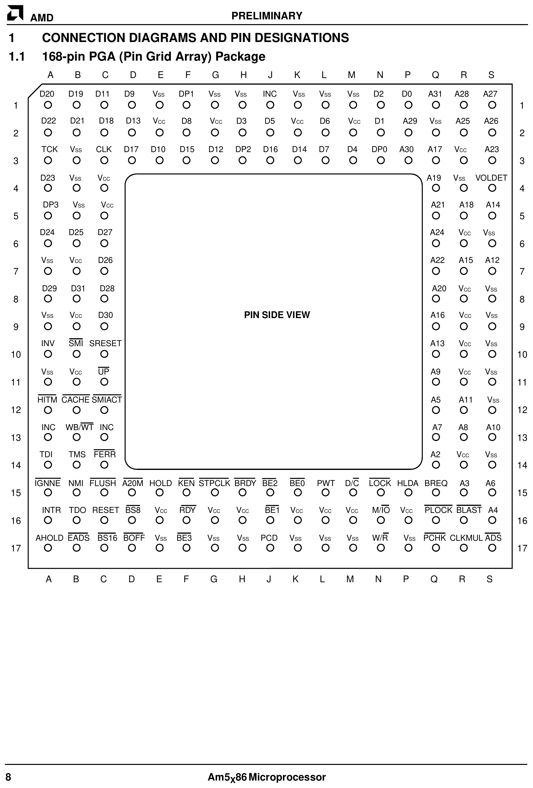

## Original CPU: IBM Blue Lightning DX2

Mine came with an **IBM Blue Lightning DX2** (486-V266GA). Clock-doubled 486, 66 MHz (33 MHz bus, 2x multiplier). Machine wasn't branded as the 66 MHz model so someone upgraded it before I got it. The Blue Lightning was IBM's own 486, write-back 16 KB internal cache, pin-compatible with the Intel 486DX2-66.

## Upgrade: AMD Am5x86-P75 (AMD-X5-133ADZ)

Drop-in Socket 3 upgrade. Pentium-75 equivalent performance (hence "P75"), fully compatible with 486 motherboards. 133 MHz on a 4x multiplier off the 33 MHz bus, 16 KB write-back L1 cache, only ~3W. See [AM5x86 Datasheet (PDF)](/docs/compaq-486c/AM5x86_Datasheet.pdf).

### Why the ADZ Variant

Several variants, all 133 MHz but with different max case temp ratings:

| Variant | Part Number | Max Case Temp | Notes |
|---------|-------------|---------------|-------|
| **ADW** | AMD-X5-133ADW | 55° C | Earliest production, requires active cooling |
| **ADY** | AMD-X5-133ADY | 75° C | Mid-range thermal rating, rare |
| **ADZ** | AMD-X5-133ADZ | 85° C | Later production, preferred for compact builds |

**ADZ is the one I need.** Compact case, limited airflow, no room for a fan. Heatsink only. ADW's 55°C limit would get exceeded easy. ADZ's 85°C gives me plenty of headroom on passive cooling.

You can see it on the chips. ADW is stamped "HEATSINK AND FAN REQD", ADZ has no such warning:

The suffix also hints at what the chip can actually do. Enthusiasts figured out it corresponds to the real designed speed:

| Suffix | Marketed Speed | Actual Capability |
|--------|---------------|-------------------|
| ADW | 133 MHz (33 x 4) | 133 MHz |
| ADY | 133 MHz | 150 MHz (50 x 3) |
| ADZ | 133 MHz | 160 MHz (40 x 4) |

AMD never released a 160 MHz part. Feared it would cannibalize their upcoming K5 (5K86). The K5 ended up being a total flop. Most people who bought the ADZ "133 MHz" ran it at 160 MHz anyway.

### Enabling the 4x Multiplier: CLKMUL Pin R17

Socket 3 has a single multiplier pin, **CLKMUL at position R-17** on the 168-pin PGA. Two states, high or low, and different CPUs interpret them differently. On a DX4, low means 2x and high means 3x. AMD remapped those states on the Am5x86 so that low means 4x instead of 2x. Socket 3 was never designed for 4x, AMD just hijacked the existing pin. You can find this in the [AM5x86 Datasheet (PDF)](/docs/compaq-486c/AM5x86_Datasheet.pdf), Section 3 Pin Descriptions under CLKMUL. The pin has an internal pull-up to Vcc, so it defaults high if left floating. CLKMUL is at R-17 on the pin grid, bottom right corner, second from the edge:

| CLKMUL (R17) State | DX4 | Am5x86 |
|---------------------|-----|--------|
| High (Vcc) or1 floating | 3x | 3x (99 MHz on 33 MHz bus) |
| Low (Vss / ground) | 2x | 4x (133 MHz on 33 MHz bus) |

On boards with a multiplier jumper, set it to "2x", that grounds CLKMUL, and the Am5x86 quadruples instead. **My Compaq has no multiplier jumper.** Pin floats, internal pull-up holds it high, CPU defaults to 3x (99 MHz).

Fix: **manually ground pin R17.** Soldered a thin wire from R17 to a nearby Vss pin on the chip. The datasheet says for 133 MHz processors this pin must always be connected to Vss. Without this the CPU boots fine but only runs at 99 MHz. Spent a while confused about the benchmarks before I figured it out.

**TODO:** Add photo of the R17 pin ground mod.
