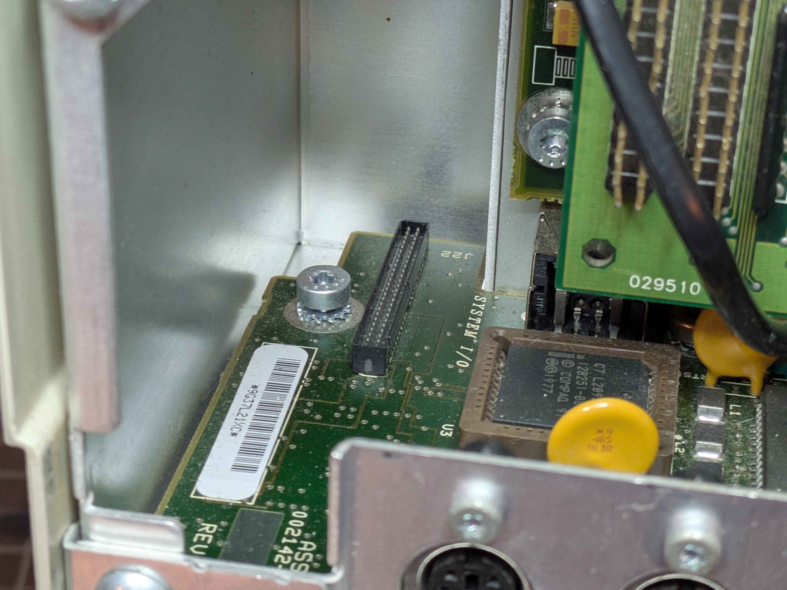

Emulate a Hayes-compatible modem using an ESP32 dev board plugged into the Compaq Portable 486c's 50-pin Enhanced Options Slot, bridging AT commands to WiFi/TCP connections. No PCMCIA slot required, no external serial cable -- just a custom card that slides in from the rear and gives this 1994 luggable a modern internal modem over WiFi. Useful for none other than original DOS terminal software dialing into BBSes.

## Status

Phase 0 -- figuring out the physical connection. The 50-pin connector is 50mil pitch, way too small for a standard breadboard. Desoldered an original connector from a modem board -- lucky they have two. Got a 50mil pitch prototype board and wiring it up manually. Other option is to design a custom breakout PCB that routes the signals out to standard 100mil headers for breadboard work. That might end up being the move if hand-wiring gets too painful.

## The Enhanced Options Slot

The Compaq Portable 486c has a proprietary 50-pin expansion connector on the system I/O board, separate from the two full-sized EISA slots. Designed for an internal modem or second serial port. Cards slide in from the rear and engage the connector. It's essentially a simplified ISA-like bus with 16-bit data, 10 address lines, IRQ, DMA, and +5V power.

**[Full options slot documentation -->](/projects/compaq-wifimodem/options-slot/)**

## Bus Summary

| What | Details |
|------|---------|
| Data bus | 8 bits needed (D0-D7, pins 2-9). 16-bit exists but a UART only needs 8. |
| Address lines | A0-A2 (pins 19-20, 37) for 8 UART registers. Higher bits (XA08 + Add4-9) for base address decode. |
| Control | IOR (pin 12), IOW (pin 11) -- active low, standard ISA timing |
| Chip select | Select (pin 10) + SLOT-IOEN (pin 49) |
| Power | +5V only (pins 15, 16). ESP32 is 3.3V -- level shifters required. |
| IRQ | Pin 13, directly to system PIC |
| Reset | Pin 17 |

ISA I/O cycles are ~1us. ESP32 at 240MHz = ~240 CPU cycles per bus cycle. Tight but workable with direct GPIO register access (not digitalRead).

**[Full pinout and ESP32 wiring reference -->](/projects/compaq-wifimodem/pinout/)**

## The Plan

### Phase 0: Bare Minimum Feasibility Test

Compaq reads a known byte from the options slot via `DEBUG`.

#### Hardware

- ESP32 dev board (ESP32-WROOM or similar, 23+ GPIOs available)
- 2x 74LVC245 (octal bus transceiver for data bus, 5V tolerant, bidirectional with DIR pin)
- Level shifting for address/control inputs (5V -> 3.3V)
- 50-pin edge connector or breakout
- Breadboard + jumper wires

#### Wiring

See **[pinout and ESP32 wiring reference](/projects/compaq-wifimodem/pinout/)** for the full wiring map (~24 GPIOs total).

#### Firmware Logic

```
1. Configure data bus GPIOs as INPUT (high-Z) by default
2. Tight polling loop on dedicated core (core 1, no FreeRTOS tasks):
   a. Wait for IOR to go LOW
   b. Check SLOT-IOEN is active and address = COM2 base (0x2F8)
   c. If address offset = 0 (RBR register):
      - Switch data bus GPIOs to OUTPUT
      - Drive 0x55 onto D0-D7 via direct register write
      - Wait for IOR to go HIGH
      - Switch data bus GPIOs back to INPUT (high-Z)
```

#### Test Procedure

1. Wire ESP32 to options slot (power OFF first)
2. Flash Phase 0 firmware
3. Configure EISA utility for modem/serial at COM2 (IRQ3, 0x2F8)
4. Boot to DOS
5. Run: `DEBUG` -> `I 2F8`
6. Expected: reads back `55`

#### Success Criteria

- `DEBUG` reads back `55` -- bus timing feasible, proceed to Phase 1
- Reads back `FF` -- ESP32 too slow, level-shifting issue, or wiring problem
- System hangs on boot -- Select/IOEN decode wrong, bus contention

### Phase 1: 16550 UART Register Emulation

DOS and terminal software detect a working COM port. Emulate all 8 standard 16550 registers at the COM port base address:

| Offset | Read | Write |
|--------|------|-------|
| 0 | RBR (Receive Buffer) | THR (Transmit Hold) |
| 1 | IER (Interrupt Enable) | IER |
| 2 | IIR (Interrupt ID) | FCR (FIFO Control) |
| 3 | LCR (Line Control) | LCR |
| 4 | MCR (Modem Control) | MCR |
| 5 | LSR (Line Status) | -- |
| 6 | MSR (Modem Status) | -- |
| 7 | SCR (Scratch) | SCR |

Key behaviors:
- LSR bit 5 (THRE) must report ready or software won't send
- LSR bit 0 (Data Ready) indicates data available in RBR
- IIR must report no-interrupt (0x01) initially
- MCR/MSR handshake lines: fake CTS/DSR as active

### Phase 2: WiFi Bridge

Bytes written to THR go out over WiFi; received TCP data appears in RBR.

- ESP32 connects to configured WiFi AP
- AT command `ATDT <host>:<port>` opens a TCP connection
- Data mode: bytes flow bidirectionally between UART registers and TCP socket
- `+++` escape sequence returns to command mode

### Phase 3: AT Command Set

Hayes-compatible command set for terminal software (Telix, Procomm, etc.)

Minimum commands:
- `AT` -> `OK`
- `ATZ` -> reset, `OK`
- `ATE0/ATE1` -> echo off/on
- `ATDThost:port` -> open TCP connection
- `ATH` -> hang up (close connection)
- `ATO` -> return to data mode
- `ATS0=1` -> auto-answer (listen mode)
- `+++` -> escape to command mode

### Phase 4: IRQ Support

Proper interrupt-driven receive for better throughput.

- Assert IRQ (pin 13) when data is available in RBR
- De-assert on IIR read or RBR read
- Implement FIFO trigger levels (FCR register)

## Key Risks

1. **Level shifting speed** -- 74LVC245 preferred over TXS0108E for reliability at ISA speeds
2. **ESP32 interrupt latency** -- FreeRTOS jitter; run ISA handler on dedicated core with interrupts disabled
3. **Bus contention** -- Data bus MUST be high-Z except during IOR cycles targeting our address
4. **Address decoding** -- Need to confirm what Select/SLOT-IOEN pre-decode vs. what we must decode
5. **ESP32 5V tolerance** -- Most ESP32 GPIOs are NOT 5V tolerant; level shift ALL inputs

## Shopping List (Phase 0)

- [ ] ESP32 dev board
- [ ] 2x 74LVC245 (data bus transceiver)
- [ ] 2x 74HCT245 or resistor dividers (address/control level shifting)
- [ ] 50-pin edge connector or 2x25 header
- [ ] Breadboard
- [ ] Jumper wires
- [ ] Multimeter (verify voltages before connecting to Compaq)

---

## Datasheets

- [Compaq Portable 486c Reference Guide (PDF)](/docs/compaq-wifimodem/Compaq_Portable_486C_Reference_Guide.pdf)
- [Compaq LTE Lite Expansion Options (PDF)](/docs/compaq-wifimodem/Compaq_LTE_Lite_Expansion_Options.pdf)

## References

- [Source Repository](https://github.com/k0bura/compaq-wifimodem) -- Project code, schematics, and reference docs
- [Compaq Portable 486c Restoration](/projects/compaq-486c-restoration/) -- The machine this card is being built for
