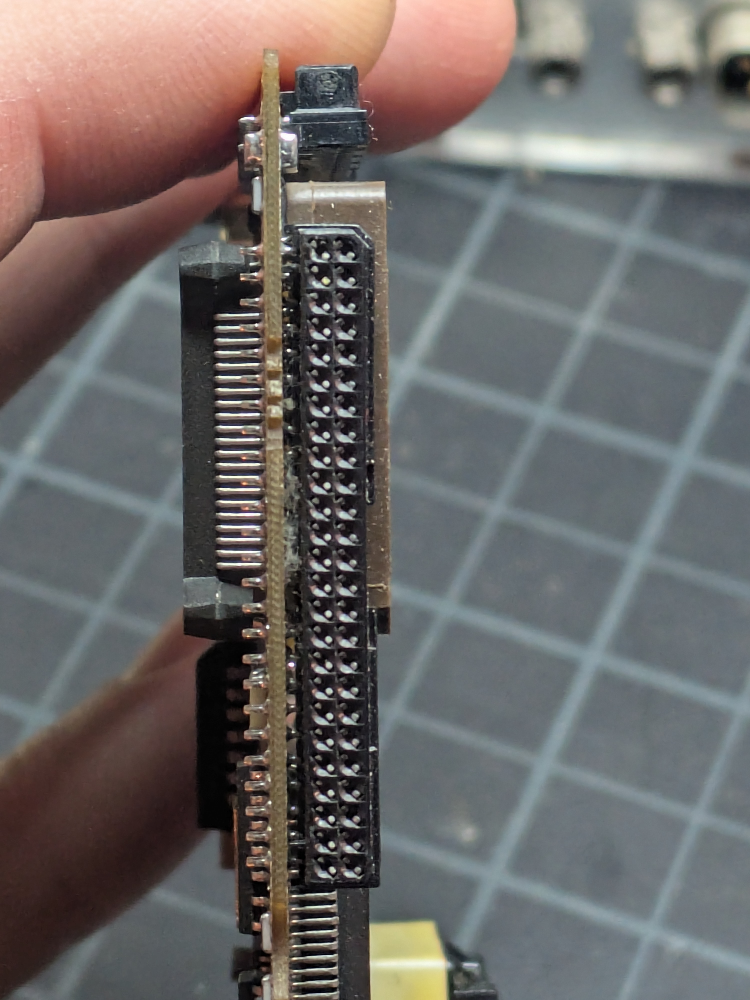
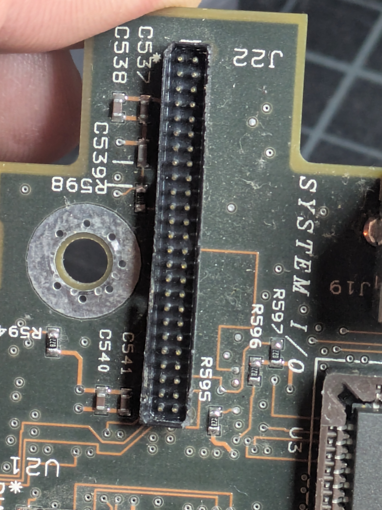

## Overview

The Enhanced Options Slot is a proprietary 50-pin expansion connector on the Compaq Portable 486c's system I/O board. Separate from the two full-sized EISA slots. Designed for an internal modem or second serial port. Cards slide in from the rear and engage the connector.

Essentially a simplified ISA-like bus. 16-bit data, 10 address lines, IRQ, DMA, +5V only. Well-suited for simple peripherals that need I/O port access, one interrupt, and optionally DMA without the full ISA/EISA bus.

**[Full 50-pin pinout and ESP32 wiring reference →](/projects/compaq-wifimodem/pinout/)**

## Signal Descriptions

### Data Bus
- **Data Bit 0-15** (Pins 2-9, 29-36): 16-bit data bus, supporting ISA-style 16-bit transfers.

### Address Bus
- **XA08** (Pin 18): Address line 8
- **Add 1-9** (Pins 19-20, 37-43): Address lines for I/O port decoding (10 address lines total including XA08, providing up to 1024 I/O port addresses).

### Control Signals
- **IOW** (Pin 11): I/O Write, active when the CPU is writing to an I/O port.
- **IOR** (Pin 12): I/O Read, active when the CPU is reading from an I/O port.
- **IRQ** (Pin 13): Interrupt Request, directly from the option board to the system interrupt controller.
- **Bus Ready** (Pin 14): Indicates the device is ready / used for wait-state insertion.
- **RST** (Pin 17): System Reset.
- **Select** (Pin 10): Chip select / board select signal.
- **IO16** (Pin 47): Indicates the device supports 16-bit I/O transfers.
- **SLOT-IOEN** (Pin 49): Slot I/O Enable, enables the slot for I/O access.

### DMA Signals
- **DMA** (Pin 28): DMA signal.
- **SLOT-DMA-** (Pin 44): Slot DMA request (active low).
- **SLOT-DRQ** (Pin 48): Slot DMA Request.
- **SLOT-DAK** (Pin 50): Slot DMA Acknowledge.
- **T-C** (Pin 45): Terminal Count, signals end of a DMA transfer.

### Power and Ground
- **+5V** (Pins 15, 16): +5V DC power supply.
- **Ground** (Pins 1, 26, 27): Ground/return.

### Miscellaneous
- **Mclock** (Pin 21): Master clock signal.
- **Slot-on** (Pin 24): Indicates the slot is active/populated.
- **SPKDRV** (Pin 25): Speaker drive, allows the option board to drive the system speaker (e.g., modem audio).
- **Reserve 1** (Pin 22): Reserved for future use.
- **Reserve 2** (Pin 23): Reserved for future use.
- **SLOT-IR08** (Pin 46): Secondary interrupt (IRQ8 line, from the second PIC).

## Configuration

Options installed in the Enhanced Options Slot are configured using the **COMPAQ EISA Configuration Utility**:

- **Method 1 (Manual):** If no .CFG file exists for the board, manually set switches/jumpers based on available system resources (IRQ, port addresses) shown in the utility.
- **Method 2 (Generic Config File):** Use a generic ISA adapter definition in the EISA Configuration Utility, then manually edit port address and IRQ resources and lock the board.

A modem configured at COM1 requires IRQ4 and port addresses 3F8-3FF. COM2 requires IRQ3 and port addresses 2F8-2FF. The EISA Configuration Utility can reallocate resources if conflicts arise.

## References

- [Compaq Portable 486c Reference Guide (PDF)](/docs/compaq-wifimodem/Compaq_Portable_486C_Reference_Guide.pdf)
- [Compaq LTE Lite Expansion Options (PDF)](/docs/compaq-wifimodem/Compaq_LTE_Lite_Expansion_Options.pdf)

*Source: Compaq Portable 486c Reference Guide, Part Number 128984-001, November 1991.*
